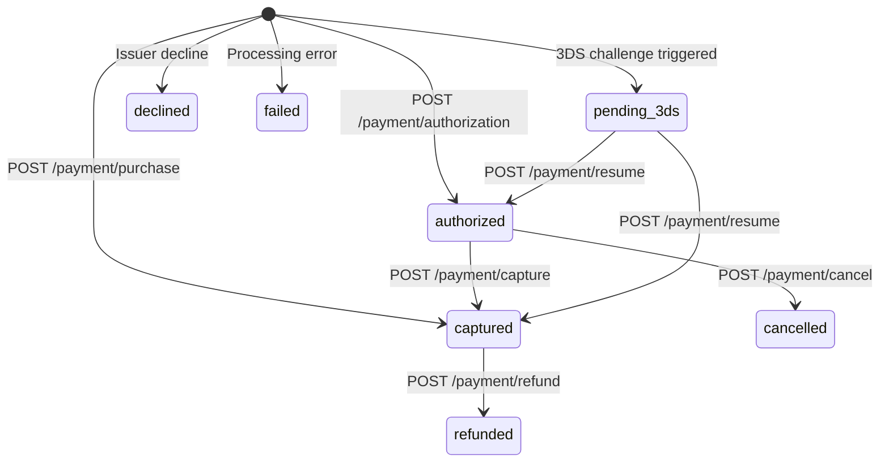

Every payment moves through a predictable series of states — from an initial reserve of funds through to final settlement or cancellation. Therius gives you two ways to move a payment through that lifecycle: a one-step flow that authorizes and captures in a single call, and a two-step flow that separates authorization from capture. Knowing which flow to use, and when each post-payment operation applies, will save you from edge cases and disputed charges.

## One-Step Flow: Purchase

Use `POST /payment/purchase` when you can fulfil the order immediately — digital downloads, SaaS subscriptions, and any product you deliver the moment payment completes. A single round-trip reserves the funds and settles them in one go. The response carries `status: "captured"`.

```json
{
  "status": "captured",
  "paymentCode": "PAY-abc123",
  "orderCode": "ORDER-001"
}
```

## Two-Step Flow: Authorize → Capture

Use `POST /payment/authorization` to reserve funds without settling them. This is the right flow when you need to confirm availability before you fulfil — for example, physical goods that may go out of stock, or hotel reservations where you confirm the room before charging.

```txt
POST /payment/authorization  →  status: "authorized"
POST /payment/capture        →  status: "captured"
```

A few rules apply:

- **Authorization window** is typically 7 days, though some acquirers allow shorter or longer windows. If you do not capture within the window, the authorization expires and the funds are released automatically.
- **Partial capture** is supported. You can capture any amount up to the authorized amount. For example, authorize $100 and capture $80 if one item is out of stock.
- Once a payment is captured you cannot capture again — use refund for any adjustments.

## Refund

Call `POST /payment/refund` to return funds on a captured payment. Refunds can be full or partial, and you can issue multiple partial refunds as long as the cumulative total does not exceed the originally captured amount.

```json
{
  "paymentCode": "PAY-abc123",
  "amount": { "currency": "USD", "value": 500, "exponent": 2 }
}
```

A partial refund of $5.00 on a $19.99 payment returns the difference to the cardholder. The payment status moves to `refunded` once a full refund is processed.

## Cancel

Call `POST /payment/cancel` to void an **authorized** payment before it is captured. Funds are released immediately and the customer is never charged. You cannot cancel a payment that has already been captured — call `POST /payment/refund` instead.

## Auto Cancel or Refund

If you are not sure whether a payment is in `authorized` or `captured` state, call `POST /payment/cancel_or_refund`. Therius checks the current state and performs the correct operation automatically — a cancel if the payment is authorized, a full refund if it is captured.

## Payment Statuses

| Status | Description |
|---|---|
| `captured` | Funds settled. The payment is complete. |
| `authorized` | Funds reserved but not yet settled. Capture or cancel next. |
| `refunded` | A full (or final partial) refund has been issued. |
| `cancelled` | Authorization voided before capture. Funds released. |
| `pending_action` | Waiting for an action from the shopper (e.g., redirect to a bank page for APM). |
| `pending_3ds` | 3DS2 challenge required. Resume with `POST /payment/resume`. |
| `declined` | Payment was declined by the issuer or acquirer. |
| `failed` | A processing error prevented the payment from completing. |

## State Machine



## `paymentCode` vs `orderCode`

When you create a payment you supply an `orderCode` — your own reference for the order (e.g., `ORDER-2024-001`). Therius returns a `paymentCode` in the response — its own receipt ID (e.g., `PAY-abc123`).

Both identifiers work interchangeably on all post-payment operations: inquiry, refund, cancel, and capture all accept either value. Use whichever is more convenient for your integration. If you support multiple payment attempts for the same order (e.g., a retry after a decline), each attempt gets its own `paymentCode` while sharing the same `orderCode`.
