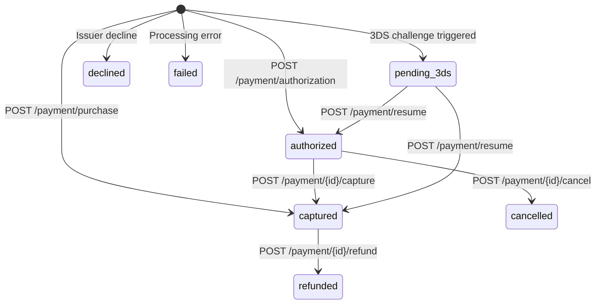

Todo pago pasa por una serie predecible de estados — desde una reserva inicial de fondos hasta la liquidación final o la cancelación. Therius te da dos formas de mover un pago a través de ese ciclo de vida: un flujo de un paso que autoriza y captura en una sola llamada, y un flujo de dos pasos que separa la autorización de la captura. Saber qué flujo usar, y cuándo aplica cada operación posterior al pago, te ahorrará casos límite y cargos disputados.

## Flujo de un paso: compra

Usa `POST /payment/purchase` cuando puedas cumplir el pedido de inmediato — descargas digitales, suscripciones SaaS y cualquier producto que entregues en el momento en que se completa el pago. Un solo viaje de ida y vuelta reserva los fondos y los liquida de una vez. La respuesta lleva `status: "captured"` y un `id` — el identificador del pago.

```json
{
  "id": "9f8b2c1e-4d5a-6b7c-8d9e-0f1a2b3c4d5e",
  "status": "captured",
  "paymentCode": "PAY-abc123",
  "orderCode": "ORDER-001"
}
```

## Flujo de dos pasos: autorizar → capturar

Usa `POST /payment/authorization` para reservar fondos sin liquidarlos. Es el flujo correcto cuando necesitas confirmar la disponibilidad antes de cumplir — por ejemplo, bienes físicos que pueden agotarse, o reservas de hotel donde confirmas la habitación antes de cobrar.

```txt
POST /payment/authorization  →  status: "authorized", id: "<payment id>"
POST /payment/{id}/capture   →  status: "captured"
```

La respuesta de autorización incluye un `id` (un UUID). Ese `id` es cómo diriges
el pago en cada operación de seguimiento — pásalo como el segmento de ruta `{id}`.

Aplican algunas reglas:

- **La ventana de autorización** suele ser de 7 días, aunque algunos adquirentes permiten ventanas más cortas o más largas. Si no capturas dentro de la ventana, la autorización expira y los fondos se liberan automáticamente.
- **La captura parcial** está disponible. Puedes capturar cualquier monto hasta el monto autorizado. Por ejemplo, autoriza $100 y captura $80 si un artículo está agotado.
- Una vez que un pago se captura no puedes capturar de nuevo — usa el reembolso para cualquier ajuste.

## Reembolso

Llama a `POST /payment/{id}/refund` para devolver fondos de un pago capturado. Los reembolsos pueden ser totales o parciales, y puedes emitir varios reembolsos parciales mientras el total acumulado no supere el monto capturado originalmente.

```json
{
  "merchantCode": "MERCHANT_001",
  "amount": { "currency": "USD", "value": 500, "exponent": 2 }
}
```

Un reembolso parcial de $5.00 sobre un pago de $19.99 devuelve la diferencia al titular de la tarjeta. El estado del pago pasa a `refunded` una vez que se procesa un reembolso total.

## Cancelar

Llama a `POST /payment/{id}/cancel` para anular un pago **autorizado** antes de que se capture. Los fondos se liberan de inmediato y nunca se le cobra al cliente. No puedes cancelar un pago que ya se capturó — llama a `POST /payment/{id}/refund` en su lugar.

## Cancelación o reembolso automático

Si no estás seguro de si un pago está en estado `authorized` o `captured`, llama a `POST /payment/{id}/cancel_or_refund`. Therius verifica el estado actual y realiza la operación correcta automáticamente — una cancelación si el pago está autorizado, un reembolso total si está capturado.

## Estados del pago

| Estado | Descripción |
|---|---|
| `captured` | Fondos liquidados. El pago está completo. |
| `authorized` | Fondos reservados pero aún no liquidados. Captura o cancela a continuación. |
| `refunded` | Se ha emitido un reembolso total (o el parcial final). |
| `cancelled` | Autorización anulada antes de la captura. Fondos liberados. |
| `pending_action` | Esperando una acción del cliente (p. ej., redirección a la página de un banco para un APM). El resultado final llega por [webhook](/webhooks/overview). |
| `pending_3ds` | Se requiere un desafío 3DS2. Reanuda con `POST /payment/resume`. |
| `declined` | El pago fue rechazado por el emisor o el adquirente. La respuesta lleva un objeto `refusalCode` — ver [Pagos rechazados](/concepts/declined-payments). |
| `failed` | Un error de procesamiento impidió que el pago se completara. |

## Máquina de estados



## `id`, `paymentCode` y `orderCode`

| Campo | Lo define | Propósito |
|---|---|---|
| `id` | Therius (devuelto en autorizar/comprar) | **El identificador del pago.** Pásalo como el segmento de ruta `{id}` de capture, refund, cancel y cancel_or_refund. |
| `orderCode` | Tú, en la llamada de creación | Tu propia referencia para el pedido (p. ej., `ORDER-2024-001`). |
| `paymentCode` | Tú (opcional) o Therius | Una referencia por intento. Si admites varios intentos para un mismo pedido (p. ej., un reintento tras un rechazo), cada intento puede llevar su propio `paymentCode` compartiendo el `orderCode`. |

`orderCode` y `paymentCode` son campos de referencia únicamente — se devuelven en las respuestas y los webhooks. [Consulta](/api-reference/inquiry) acepta el `id` o el `paymentCode` en su ruta. Pero capture, refund, cancel y cancel_or_refund toman **solo** el `id`. Guarda siempre el `id` de la respuesta de autorizar/comprar y úsalo para esas llamadas.
