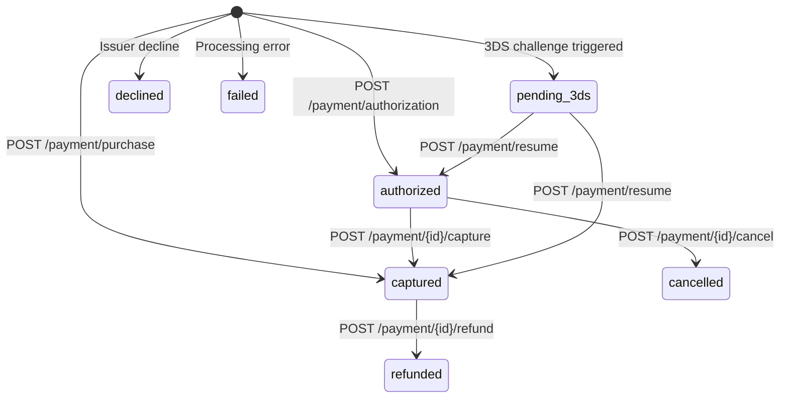

Todo pagamento passa por uma série previsível de estados — de uma reserva inicial de fundos até a liquidação final ou o cancelamento. O Therius oferece duas formas de mover um pagamento por esse ciclo de vida: um fluxo de uma etapa que autoriza e captura em uma única chamada, e um fluxo de duas etapas que separa a autorização da captura. Saber qual fluxo usar, e quando cada operação pós-pagamento se aplica, vai poupar você de casos de borda e cobranças contestadas.

## Fluxo de uma etapa: compra

Use `POST /payment/purchase` quando você puder atender o pedido imediatamente — downloads digitais, assinaturas SaaS e qualquer produto entregue no momento em que o pagamento é concluído. Uma única ida e volta reserva os fundos e os liquida de uma vez. A resposta traz `status: "captured"` e um `id` — o identificador do pagamento.

```json
{
  "id": "9f8b2c1e-4d5a-6b7c-8d9e-0f1a2b3c4d5e",
  "status": "captured",
  "paymentCode": "PAY-abc123",
  "orderCode": "ORDER-001"
}
```

## Fluxo de duas etapas: autorizar → capturar

Use `POST /payment/authorization` para reservar fundos sem liquidá-los. É o fluxo certo quando você precisa confirmar a disponibilidade antes de atender — por exemplo, produtos físicos que podem esgotar, ou reservas de hotel em que você confirma o quarto antes de cobrar.

```txt
POST /payment/authorization  →  status: "authorized", id: "<payment id>"
POST /payment/{id}/capture   →  status: "captured"
```

A resposta de autorização inclui um `id` (um UUID). Esse `id` é como você endereça
o pagamento em toda operação de acompanhamento — passe-o como o segmento de caminho `{id}`.

Algumas regras se aplicam:

- **A janela de autorização** costuma ser de 7 dias, embora alguns adquirentes permitam janelas mais curtas ou mais longas. Se você não capturar dentro da janela, a autorização expira e os fundos são liberados automaticamente.
- **A captura parcial** é compatível. Você pode capturar qualquer valor até o valor autorizado. Por exemplo, autorize $100 e capture $80 se um item estiver esgotado.
- Depois que um pagamento é capturado você não pode capturar de novo — use o reembolso para qualquer ajuste.

## Reembolso

Chame `POST /payment/{id}/refund` para devolver fundos de um pagamento capturado. Os reembolsos podem ser totais ou parciais, e você pode emitir vários reembolsos parciais desde que o total acumulado não ultrapasse o valor capturado originalmente.

```json
{
  "merchantCode": "MERCHANT_001",
  "amount": { "currency": "USD", "value": 500, "exponent": 2 }
}
```

Um reembolso parcial de $5.00 sobre um pagamento de $19.99 devolve a diferença ao titular do cartão. O status do pagamento passa a `refunded` assim que um reembolso total é processado.

## Cancelar

Chame `POST /payment/{id}/cancel` para anular um pagamento **autorizado** antes que ele seja capturado. Os fundos são liberados imediatamente e o cliente nunca é cobrado. Você não pode cancelar um pagamento que já foi capturado — chame `POST /payment/{id}/refund` em vez disso.

## Cancelamento ou reembolso automático

Se você não tem certeza se um pagamento está no estado `authorized` ou `captured`, chame `POST /payment/{id}/cancel_or_refund`. O Therius verifica o estado atual e realiza a operação correta automaticamente — um cancelamento se o pagamento está autorizado, um reembolso total se está capturado.

## Status do pagamento

| Status | Descrição |
|---|---|
| `captured` | Fundos liquidados. O pagamento está concluído. |
| `authorized` | Fundos reservados mas ainda não liquidados. Capture ou cancele a seguir. |
| `refunded` | Um reembolso total (ou o parcial final) foi emitido. |
| `cancelled` | Autorização anulada antes da captura. Fundos liberados. |
| `pending_action` | Aguardando uma ação do cliente (por exemplo, redirecionamento para a página de um banco para um APM). O resultado final chega por [webhook](/webhooks/overview). |
| `pending_3ds` | Desafio 3DS2 necessário. Retome com `POST /payment/resume`. |
| `declined` | O pagamento foi recusado pelo emissor ou pelo adquirente. A resposta traz um objeto `refusalCode` — veja [Pagamentos recusados](/concepts/declined-payments). |
| `failed` | Um erro de processamento impediu que o pagamento fosse concluído. |

## Máquina de estados



## `id`, `paymentCode` e `orderCode`

| Campo | Definido por | Finalidade |
|---|---|---|
| `id` | Therius (retornado na autorização/compra) | **O identificador do pagamento.** Passe-o como o segmento de caminho `{id}` de capture, refund, cancel e cancel_or_refund. |
| `orderCode` | Você, na chamada de criação | Sua própria referência para o pedido (por exemplo, `ORDER-2024-001`). |
| `paymentCode` | Você (opcional) ou o Therius | Uma referência por tentativa. Se você aceita várias tentativas para um mesmo pedido (por exemplo, uma nova tentativa após uma recusa), cada tentativa pode carregar seu próprio `paymentCode` compartilhando o `orderCode`. |

`orderCode` e `paymentCode` são apenas campos de referência — são retornados nas respostas e nos webhooks. A [Consulta](/api-reference/inquiry) aceita o `id` ou o `paymentCode` no caminho. Mas capture, refund, cancel e cancel_or_refund aceitam **somente** o `id`. Sempre armazene o `id` da resposta de autorização/compra e use-o nessas chamadas.
